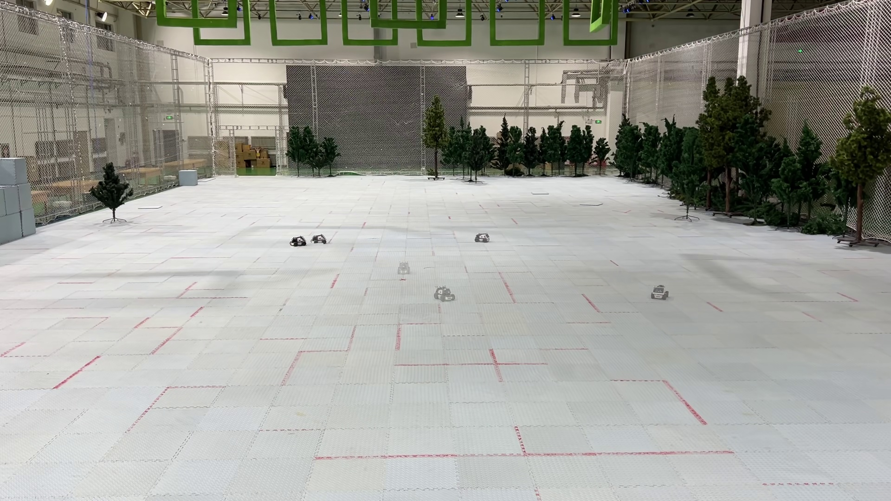

<div align="right">
  <a href="README.md"></a>
  <a href="README_zh.md"></a>
</div>

# Video2Traj

## 📹 Video to Trajectory Figure Generator

**For Robotics Researchers**: A specialized tool to visualize robot trajectories from experimental videos for papers and presentations.

### ⚠️ Important Limitations

This toolbox is designed for **static backgrounds with fixed camera positions**. It currently does **not** handle:

- Moving/dynamic backgrounds
- Moving camera or handheld footage
- Significant camera shake or drift

For best results, use videos recorded with a stationary camera in a controlled environment.

### ✨ Features

- **🎯 Multiple Frame Selection Modes**
  - Uniform sampling with configurable intervals
  - Manual frame specification
  - Interactive GUI with real-time preview
- **🎨 High-Quality Rendering**
  - Per-frame alpha compositing for natural blending
  - Morphological refinement for clean masks
  - LAB color space + gradient-based segmentation
  - Soft edge support for smoother shadows
- **📊 Trajectory Data Export**
  - JSON output with centroid, bounding box, and area per frame
  - Ready for downstream analysis and plotting

### 📦 Installation

```bash
# Clone the repository
git clone https://github.com/yourusername/video2traj.git
cd video2traj

# Install dependencies
pip install -r requirements.txt
```

### 🚀 Quick Start

**Try with Example Video**

```bash
uv run python video2traj.py examples/example_in.mp4 -o examples/example_out.jpg
```



*Source: [IEEE Trans. Robot. (T-RO)](https://ieeexplore.ieee.org/document/11300826/)*

**Uniform Sampling (Default)**

```bash
uv run python video2traj.py examples/example_in.mp4 -o examples/example_out.jpg --num-frames 30
```

**Manual Frame Selection**

```bash
uv run python video2traj.py examples/example_in.mp4 -o examples/example_out.jpg --manual "30,60,90,120"
```

**Interactive Mode in Video Player**

```bash
uv run python video2traj.py examples/example_in.mp4 -o examples/example_out.jpg --interactive
```

Interactive Controls:

- `SPACE` - Play/Pause
- `S` - Mark current frame
- `D` - Undo last mark
- `←/→` - Step one frame
- Drag trackbar - Seek to frame
- `P` - Open/close preview of selected frames
- `ESC/Q` - Confirm and exit

### ⚙️ Advanced Parameters

**Frame Selection**

```bash
--num-frames 50                 # Number of frames to sample
--start-frame 100               # Start from frame 100
--end-frame 500                 # End at frame 500
```

**Background Extraction**

```bash
--num-samples 10                # Background sampling frames
```

**Alpha Blending**

```bash
--alpha-start 0.3               # Earliest shadow opacity (0-1)
--alpha-end 1.0                 # Latest shadow opacity (0-1)
```

**Segmentation**

```bash
--diff-threshold 20             # LAB difference threshold (0=auto OTSU)
--no-gradient                   # Disable gradient-based segmentation
--grad-threshold 15             # Gradient difference threshold
```

**Mask Refinement**

```bash
--blur-size 5                   # Gaussian blur kernel (must be odd)
--close-kernel-size 21          # Morphological closing kernel
--open-kernel-size 5            # Morphological opening kernel
--min-motion-area 100           # Minimum mask area (pixels)
--soft-edge 9                   # Soft edge kernel (must be odd, 0=disabled)
```

**Full Example**

```bash
python video2traj.py input.mp4 -o output.jpg \
  --num-frames 50 \
  --diff-threshold 30 \
  --soft-edge 11 \
  --alpha-start 0.2 \
  --alpha-end 1.0
```

### 📄 Output

- `output.jpg` - Stroboscopic trajectory image
- `output.json` - Trajectory data with per-frame information:
  ```json
  [
    {
      "frame": 30,
      "cx": 512.34,
      "cy": 384.67,
      "bbox": [450, 320, 120, 80],
      "area": 8456.2
    }
  ]
  ```

### 🎓 Credits

This project was inspired by [videoStrobe](https://github.com/demolen/videoStrobe) by demolen. We extend our gratitude for the original concept and implementation.

### 📝 License

MIT License - feel free to use this in your research and projects!

### 🧪 Testing

Run the test suite to verify installation:

```bash
# Run all tests
python tests/run_all_tests.py

# Run specific test
python tests/test_synthetic.py
python tests/test_regression.py
```

See [tests/README.md](tests/README.md) for detailed testing documentation.

### 🤝 Contributing

Contributions are welcome! Please feel free to submit a Pull Request.
